# Checking for differences in SNP/Ecotype Frequency across D11 pilot samples

-   snp_frequency.txt: The estimated frequencies of alternative alleles in the reference panel from the pool seq data.

-   ecotype_frequency.txt: The estimated frequencies of all genotypes in the reference panel from the pool seq data.

## Load Libraries


``` r
library(tidyverse)
```

```
## ── Attaching core tidyverse packages ──────────────────────── tidyverse 2.0.0 ──
## ✔ dplyr     1.1.4     ✔ readr     2.1.5
## ✔ forcats   1.0.0     ✔ stringr   1.5.1
## ✔ ggplot2   3.5.1     ✔ tibble    3.2.1
## ✔ lubridate 1.9.3     ✔ tidyr     1.3.1
## ✔ purrr     1.0.2     
## ── Conflicts ────────────────────────────────────────── tidyverse_conflicts() ──
## ✖ dplyr::filter() masks stats::filter()
## ✖ dplyr::lag()    masks stats::lag()
## ℹ Use the conflicted package (<http://conflicted.r-lib.org/>) to force all conflicts to become errors
```

## Load data


``` r
rep1_ecotypes <- read_delim("../../Analyzing Genetic Data/DispersalTraps/hapFire_Results/D11Rep1_testJM3_ecotype_frequency.txt", col_names = c("Genotype", "Freq")) %>% mutate(Rep="1")
```

```
## Rows: 231 Columns: 2
## ── Column specification ────────────────────────────────────────────────────────
## Delimiter: "\t"
## dbl (2): Genotype, Freq
## 
## ℹ Use `spec()` to retrieve the full column specification for this data.
## ℹ Specify the column types or set `show_col_types = FALSE` to quiet this message.
```

``` r
rep1_snps <- read_delim("../../Analyzing Genetic Data/DispersalTraps/hapFire_Results/D11Rep1_testJM3_snp_frequency.txt", col_names = c("Chrom", "Pos", "Freq")) %>% mutate(Rep="1")
```

```
## Rows: 3235480 Columns: 3
## ── Column specification ────────────────────────────────────────────────────────
## Delimiter: "\t"
## dbl (3): Chrom, Pos, Freq
## 
## ℹ Use `spec()` to retrieve the full column specification for this data.
## ℹ Specify the column types or set `show_col_types = FALSE` to quiet this message.
```

``` r
rep2_ecotypes <- read_delim("../../Analyzing Genetic Data/DispersalTraps/hapFire_Results/D11Rep2_ecotype_frequency.txt", col_names = c("Genotype", "Freq")) %>% mutate(Rep="2")
```

```
## Rows: 231 Columns: 2
## ── Column specification ────────────────────────────────────────────────────────
## Delimiter: "\t"
## dbl (2): Genotype, Freq
## 
## ℹ Use `spec()` to retrieve the full column specification for this data.
## ℹ Specify the column types or set `show_col_types = FALSE` to quiet this message.
```

``` r
rep2_snps <- read_delim("../../Analyzing Genetic Data/DispersalTraps/hapFire_Results/D11Rep2_snp_frequency.txt", col_names = c("Chrom", "Pos", "Freq")) %>% mutate(Rep="2")
```

```
## Rows: 3235480 Columns: 3
## ── Column specification ────────────────────────────────────────────────────────
## Delimiter: "\t"
## dbl (3): Chrom, Pos, Freq
## 
## ℹ Use `spec()` to retrieve the full column specification for this data.
## ℹ Specify the column types or set `show_col_types = FALSE` to quiet this message.
```

``` r
rep3_ecotypes <- read_delim("../../Analyzing Genetic Data/DispersalTraps/hapFire_Results/D11Rep3_ecotype_frequency.txt", col_names = c("Genotype", "Freq")) %>% mutate(Rep="3")
```

```
## Rows: 231 Columns: 2
## ── Column specification ────────────────────────────────────────────────────────
## Delimiter: "\t"
## dbl (2): Genotype, Freq
## 
## ℹ Use `spec()` to retrieve the full column specification for this data.
## ℹ Specify the column types or set `show_col_types = FALSE` to quiet this message.
```

``` r
rep3_snps <- read_delim("../../Analyzing Genetic Data/DispersalTraps/hapFire_Results/D11Rep3_snp_frequency.txt", col_names = c("Chrom", "Pos", "Freq")) %>% mutate(Rep="3")
```

```
## Rows: 3235480 Columns: 3
## ── Column specification ────────────────────────────────────────────────────────
## Delimiter: "\t"
## dbl (3): Chrom, Pos, Freq
## 
## ℹ Use `spec()` to retrieve the full column specification for this data.
## ℹ Specify the column types or set `show_col_types = FALSE` to quiet this message.
```

``` r
rep4_ecotypes <- read_delim("../../Analyzing Genetic Data/DispersalTraps/hapFire_Results/D11Rep4_ecotype_frequency.txt", col_names = c("Genotype", "Freq")) %>% mutate(Rep="4")
```

```
## Rows: 231 Columns: 2
## ── Column specification ────────────────────────────────────────────────────────
## Delimiter: "\t"
## dbl (2): Genotype, Freq
## 
## ℹ Use `spec()` to retrieve the full column specification for this data.
## ℹ Specify the column types or set `show_col_types = FALSE` to quiet this message.
```

``` r
rep4_snps <- read_delim("../../Analyzing Genetic Data/DispersalTraps/hapFire_Results/D11Rep4_snp_frequency.txt", col_names = c("Chrom", "Pos", "Freq")) %>% mutate(Rep="4")
```

```
## Rows: 3235480 Columns: 3
## ── Column specification ────────────────────────────────────────────────────────
## Delimiter: "\t"
## dbl (3): Chrom, Pos, Freq
## 
## ℹ Use `spec()` to retrieve the full column specification for this data.
## ℹ Specify the column types or set `show_col_types = FALSE` to quiet this message.
```

``` r
rep5_ecotypes <- read_delim("../../Analyzing Genetic Data/DispersalTraps/hapFire_Results/D11Rep5_ecotype_frequency.txt", col_names = c("Genotype", "Freq")) %>% mutate(Rep="5")
```

```
## Rows: 231 Columns: 2
## ── Column specification ────────────────────────────────────────────────────────
## Delimiter: "\t"
## dbl (2): Genotype, Freq
## 
## ℹ Use `spec()` to retrieve the full column specification for this data.
## ℹ Specify the column types or set `show_col_types = FALSE` to quiet this message.
```

``` r
rep5_snps <- read_delim("../../Analyzing Genetic Data/DispersalTraps/hapFire_Results/D11Rep5_snp_frequency.txt", col_names = c("Chrom", "Pos", "Freq")) %>% mutate(Rep="5")
```

```
## Rows: 3235480 Columns: 3
## ── Column specification ────────────────────────────────────────────────────────
## Delimiter: "\t"
## dbl (3): Chrom, Pos, Freq
## 
## ℹ Use `spec()` to retrieve the full column specification for this data.
## ℹ Specify the column types or set `show_col_types = FALSE` to quiet this message.
```

## Merge

``` r
all_ecotypes <- rep1_ecotypes %>% 
  bind_rows(rep2_ecotypes) %>% 
  bind_rows(rep3_ecotypes) %>% 
  bind_rows(rep4_ecotypes) %>% 
  bind_rows(rep5_ecotypes)

all_snps <- rep1_snps %>% 
  bind_rows(rep2_snps) %>% 
  bind_rows(rep3_snps) %>% 
  bind_rows(rep4_snps) %>% 
  bind_rows(rep5_snps)
```

## Plotting Ecotypes

``` r
all_ecotypes %>% 
  filter(Genotype<6000) %>% 
  mutate(Genotype=as.character(Genotype)) %>% 
  ggplot(aes(x=Genotype, y=Freq, group = Rep, colour = Rep)) +
  geom_point() +
  geom_line(alpha=0.5)
```

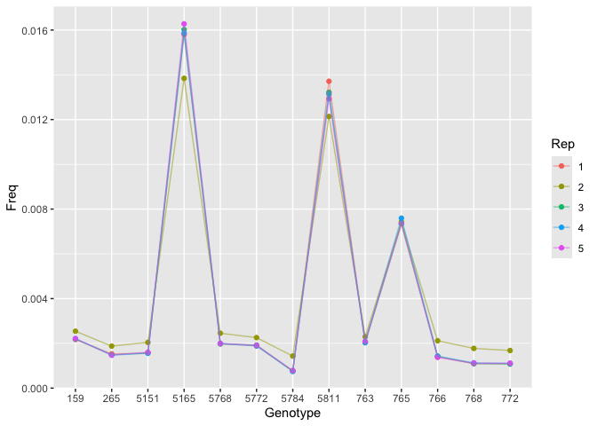<!-- -->

``` r
all_ecotypes %>% 
  filter(Genotype>6000, Genotype<6200) %>% 
  mutate(Genotype=as.character(Genotype)) %>% 
  ggplot(aes(x=Genotype, y=Freq, group = Rep, colour = Rep)) +
  geom_point() +
  geom_line(alpha=0.5)
```

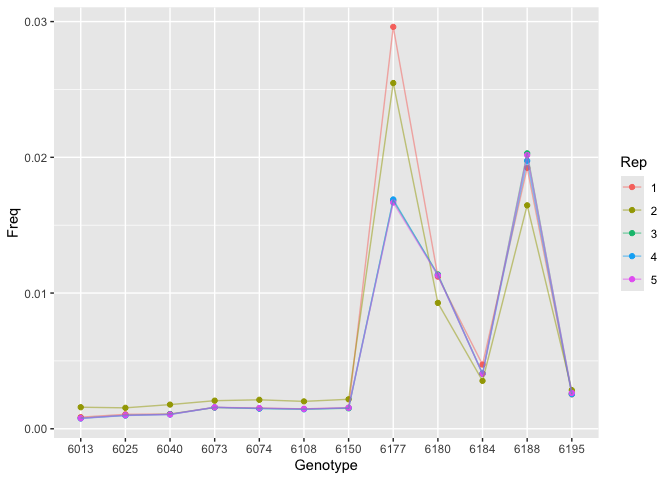<!-- -->

``` r
all_ecotypes %>% 
  filter(Genotype>6200, Genotype<6980) %>% 
  mutate(Genotype=as.character(Genotype)) %>% 
  ggplot(aes(x=Genotype, y=Freq, group = Rep, colour = Rep)) +
  geom_point() +
  geom_line(alpha=0.5)
```

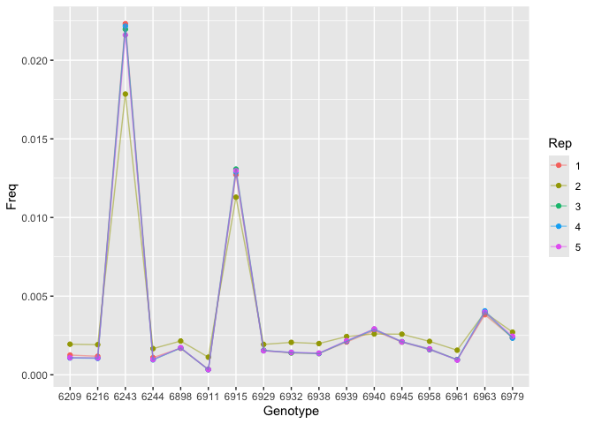<!-- -->

``` r
all_ecotypes %>% 
  filter(Genotype>6980, Genotype<7060) %>% 
  mutate(Genotype=as.character(Genotype)) %>% 
  ggplot(aes(x=Genotype, y=Freq, group = Rep, colour = Rep)) +
  geom_point() +
  geom_line(alpha=0.5)
```

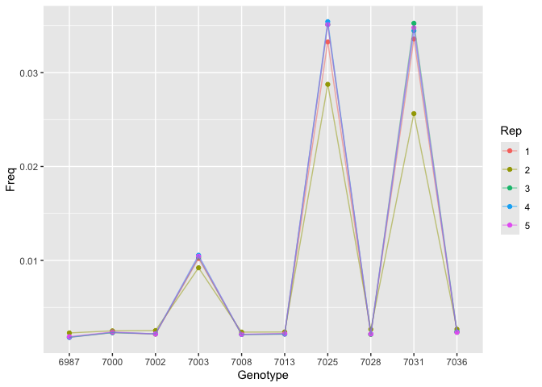<!-- -->

``` r
all_ecotypes %>% 
  filter(Genotype>7060, Genotype<7180) %>% 
  mutate(Genotype=as.character(Genotype)) %>% 
  ggplot(aes(x=Genotype, y=Freq, group = Rep, colour = Rep)) +
  geom_point() +
  geom_line(alpha=0.5)
```

<!-- -->

``` r
all_ecotypes %>% 
  filter(Genotype>7180, Genotype<7300) %>% 
  mutate(Genotype=as.character(Genotype)) %>% 
  ggplot(aes(x=Genotype, y=Freq, group = Rep, colour = Rep)) +
  geom_point() +
  geom_line(alpha=0.5)
```

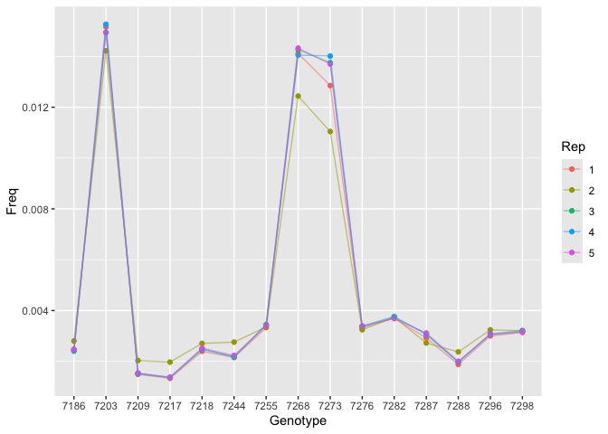<!-- -->

``` r
all_ecotypes %>% 
  filter(Genotype>7300, Genotype<8000) %>% 
  mutate(Genotype=as.character(Genotype)) %>% 
  ggplot(aes(x=Genotype, y=Freq, group = Rep, colour = Rep)) +
  geom_point() +
  geom_line(alpha=0.5)
```

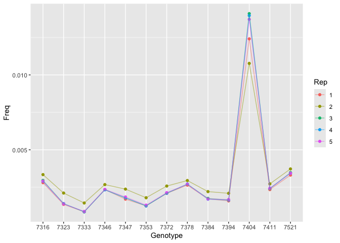<!-- -->

``` r
all_ecotypes %>% 
  filter(Genotype>8000, Genotype<9000) %>% 
  mutate(Genotype=as.character(Genotype)) %>% 
  ggplot(aes(x=Genotype, y=Freq, group = Rep, colour = Rep)) +
  geom_point() +
  geom_line(alpha=0.5)
```

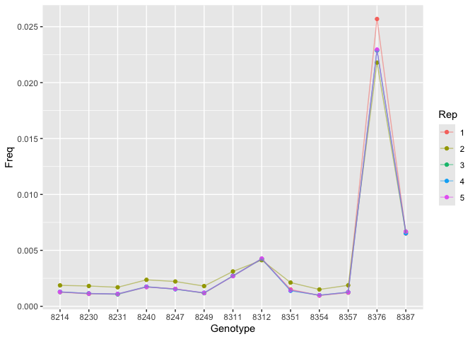<!-- -->

``` r
all_ecotypes %>% 
  filter(Genotype>9000, Genotype<9500) %>% 
  mutate(Genotype=as.character(Genotype)) %>% 
  ggplot(aes(x=Genotype, y=Freq, group = Rep, colour = Rep)) +
  geom_point() +
  geom_line(alpha=0.5)
```

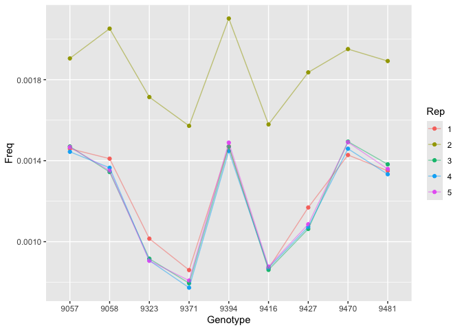<!-- -->

``` r
all_ecotypes %>% 
  filter(Genotype>9500, Genotype<9550) %>% 
  mutate(Genotype=as.character(Genotype)) %>% 
  ggplot(aes(x=Genotype, y=Freq, group = Rep, colour = Rep)) +
  geom_point() +
  geom_line(alpha=0.5)
```

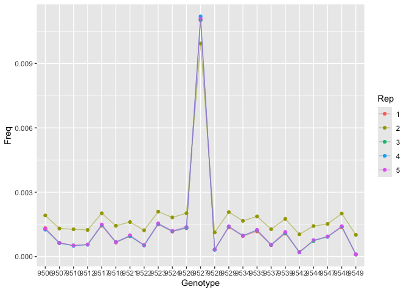<!-- -->

``` r
all_ecotypes %>% 
  filter(Genotype>9550, Genotype<9600) %>% 
  mutate(Genotype=as.character(Genotype)) %>% 
  ggplot(aes(x=Genotype, y=Freq, group = Rep, colour = Rep)) +
  geom_point() +
  geom_line(alpha=0.5)
```

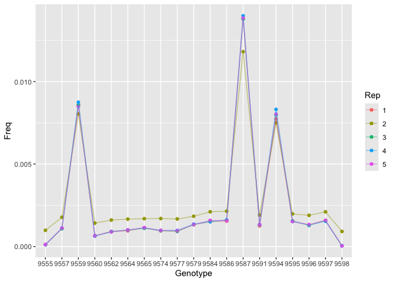<!-- -->

``` r
all_ecotypes %>% 
  filter(Genotype>9600, Genotype<9700) %>% 
  mutate(Genotype=as.character(Genotype)) %>% 
  ggplot(aes(x=Genotype, y=Freq, group = Rep, colour = Rep)) +
  geom_point() +
  geom_line(alpha=0.5)
```

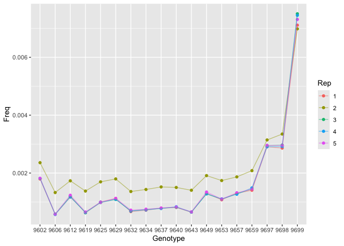<!-- -->

``` r
all_ecotypes %>% 
  filter(Genotype>9700, Genotype<9750) %>% 
  mutate(Genotype=as.character(Genotype)) %>% 
  ggplot(aes(x=Genotype, y=Freq, group = Rep, colour = Rep)) +
  geom_point() +
  geom_line(alpha=0.5)
```

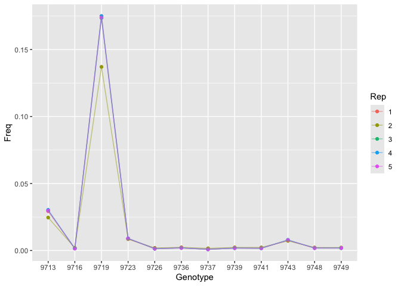<!-- -->

``` r
all_ecotypes %>% 
  filter(Genotype>9750, Genotype<9800) %>% 
  mutate(Genotype=as.character(Genotype)) %>% 
  ggplot(aes(x=Genotype, y=Freq, group = Rep, colour = Rep)) +
  geom_point() +
  geom_line(alpha=0.5)
```

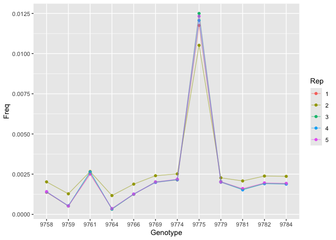<!-- -->

``` r
all_ecotypes %>% 
  filter(Genotype>9800, Genotype<9900) %>% 
  mutate(Genotype=as.character(Genotype)) %>% 
  ggplot(aes(x=Genotype, y=Freq, group = Rep, colour = Rep)) +
  geom_point() +
  geom_line(alpha=0.5)
```

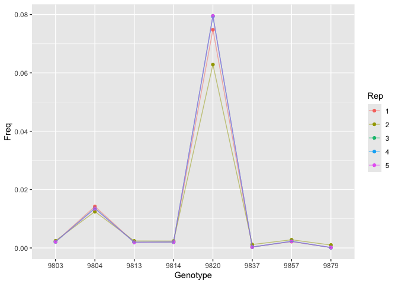<!-- -->

``` r
all_ecotypes %>% 
  filter(Genotype>9900, Genotype<10000) %>% 
  mutate(Genotype=as.character(Genotype)) %>% 
  ggplot(aes(x=Genotype, y=Freq, group = Rep, colour = Rep)) +
  geom_point() +
  geom_line(alpha=0.5)
```

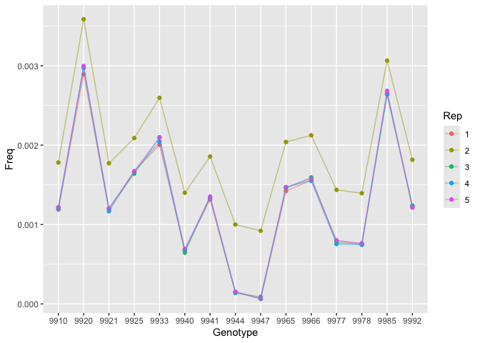<!-- -->

``` r
all_ecotypes %>% 
  filter(Genotype>10000) %>% 
  mutate(Genotype=as.character(Genotype)) %>% 
  ggplot(aes(x=Genotype, y=Freq, group = Rep, colour = Rep)) +
  geom_point() +
  geom_line(alpha=0.5)
```

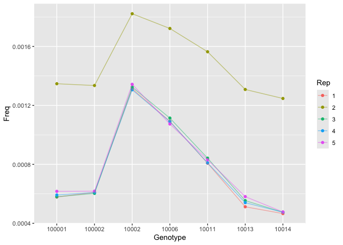<!-- -->
The different samples mostly follow the same trends. However, Rep 2 seems to be at higher or lower freq than the others frequently. Rep 2 also sometimes diverges from Reps 3-5.

## Plotting SNPs

``` r
all_snps %>% 
  filter(Chrom==1, Pos<1000) %>% 
  ggplot(aes(x=Pos, y=Freq, group=Rep, colour = Rep)) +
  geom_point() +
  geom_line(alpha=0.5)
```

<!-- -->

``` r
all_snps %>% 
  filter(Chrom==2, Pos<100000) %>% 
  ggplot(aes(x=Pos, y=Freq, group=Rep, colour = Rep)) +
  geom_point() +
  geom_line(alpha=0.5)
```

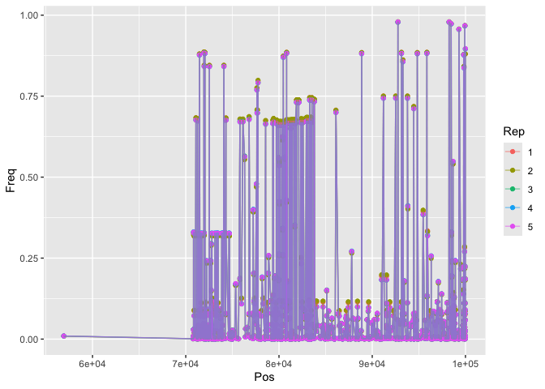<!-- -->

``` r
summary(all_snps)
```

```
##      Chrom            Pos                Freq              Rep           
##  Min.   :1.000   Min.   :      53   Min.   :0.000000   Length:16177400   
##  1st Qu.:1.000   1st Qu.: 6412878   1st Qu.:0.003355   Class :character  
##  Median :3.000   Median :11683714   Median :0.017488   Mode  :character  
##  Mean   :2.934   Mean   :12381345   Mean   :0.103462                     
##  3rd Qu.:4.000   3rd Qu.:17844662   3rd Qu.:0.087967                     
##  Max.   :5.000   Max.   :30422698   Max.   :1.000000
```


