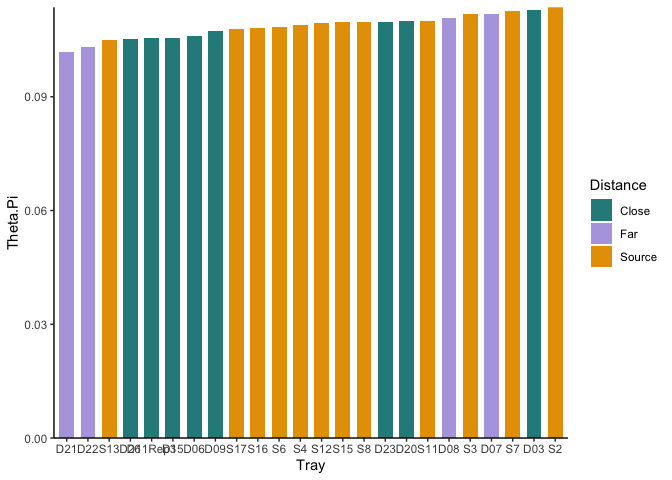
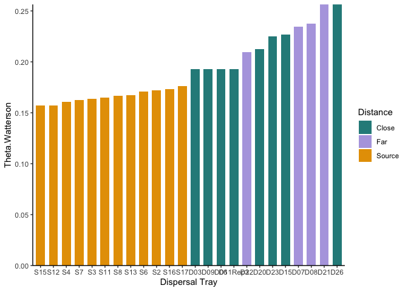
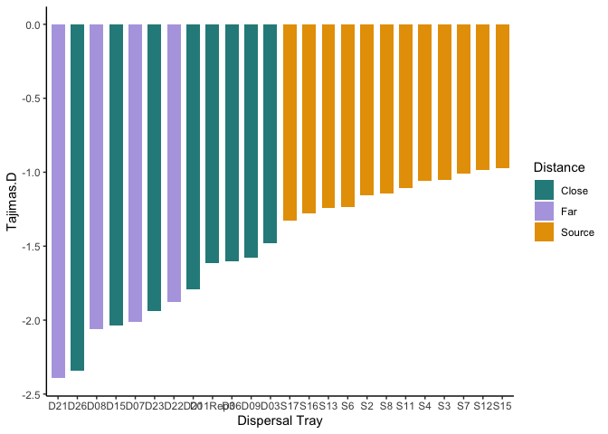
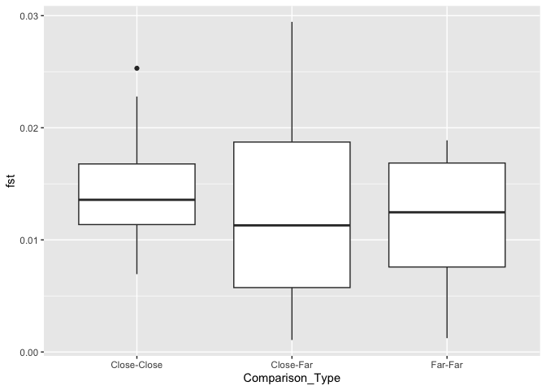
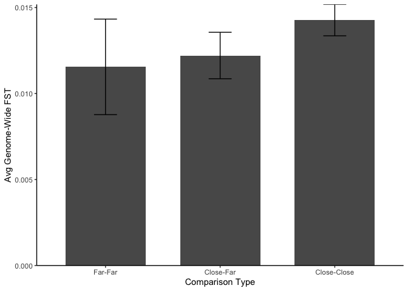
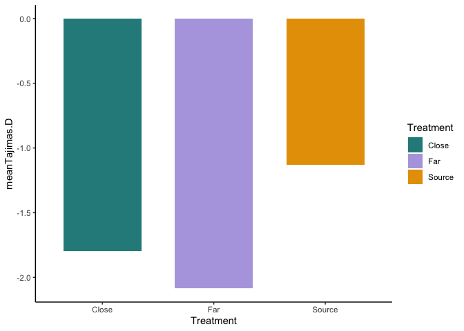
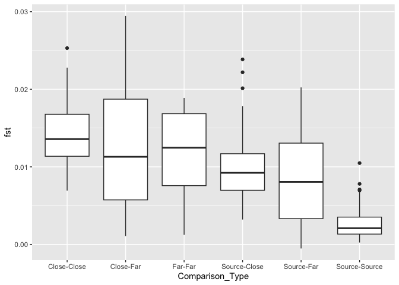
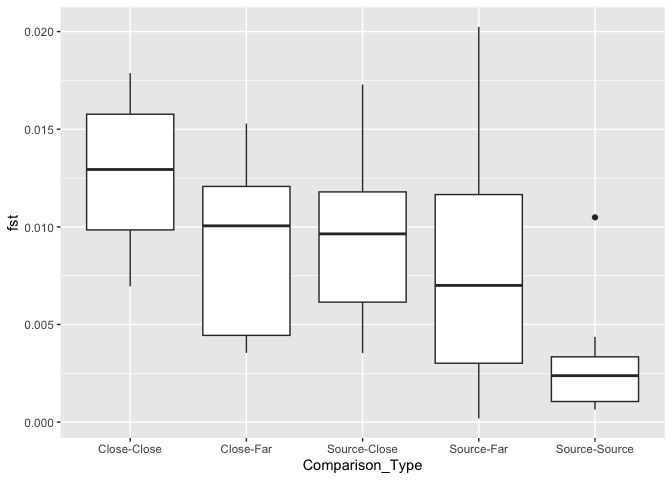
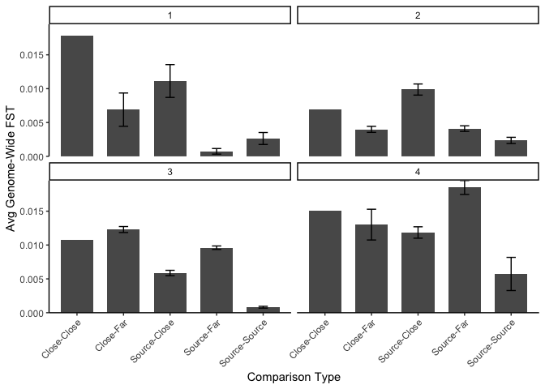

# Analyzing the genetic data from the Close and Far dispersal trays

To Do:

-   Try computing the diversity metrics and FST using sliding windows so that I can get estimates of variation across the genome

-   Compare ecotype frequencies (did some ecotypes disperse better?)

-   Figure out a way to test for bias in allele frequencies

Next steps From KD:

1.  Compare genetic diversity in dispersed versus non-dispersed samples (source versus far, and near versus far)

2.  Determine whether the source/near versus far samples differ in allele freq at specific loci across the genome (Fst). If so, that would identify alleles that occur more in dispersed pops (bias). I think this would be a comparison between pairs to begin, rather than all possible trays. If you identify potential loci, then you could calculate the allele freq at that locus in all pops and compare between far and source using all pops, but there would be low power. If you DO find something, though that would be very convincing. There are probably more powerful ways to test for allele-freq diffs

3.  While far more challenging, it would be good to look at Moi's code to see whether you can identify ecotypes that have been dispersed, and compare the frequency of those ecotypes between source/near versus far trays--another metric of "bias". Same concerns as in b. (Note: for this, we would need to get the actual ecotype freqs for the sources, right now we just have the ecotype freq difference from the founders)

Block Info:

-   Block 1
    -   Sources: 2, 3, 6
    -   Close trays: 3, 6 (no data: 1, 4)
    -   Far tray: 7
-   Block 2
    -   Sources: 4, 7, 8
    -   Close trays: 9, 11 (no data: 12, 14)
    -   Far tray: 8
-   Block 3
    -   Sources: 11, 12, 15
    -   Close trays: 15, 20 (no data: 17, 18)
    -   Far tray: 21
-   Block 4
    -   Sources: 13, 16, 17

    -   Close trays: 23, 26 (no data: 25, 28)

    -   Far tray: 22

## Libraries


``` r
library(tidyverse)
```

```
## ── Attaching core tidyverse packages ──────────────────────── tidyverse 2.0.0 ──
## ✔ dplyr     1.1.4     ✔ readr     2.1.5
## ✔ forcats   1.0.0     ✔ stringr   1.5.1
## ✔ ggplot2   3.5.1     ✔ tibble    3.2.1
## ✔ lubridate 1.9.3     ✔ tidyr     1.3.1
## ✔ purrr     1.0.2     
## ── Conflicts ────────────────────────────────────────── tidyverse_conflicts() ──
## ✖ dplyr::filter() masks stats::filter()
## ✖ dplyr::lag()    masks stats::lag()
## ℹ Use the conflicted package (<http://conflicted.r-lib.org/>) to force all conflicts to become errors
```

``` r
sem <- function(x, na.rm=FALSE) {           #for calculating standard error
  sd(x,na.rm=na.rm)/sqrt(length(na.omit(x)))
} 
```

## Prep Source Tray SNPs

``` r
source_snps <- read_csv("../../Analyzing Genetic Data/GrENE-net Cages/site28_hapFIRE_allele_frequency.csv") %>%
  select(`28_1_2`:`28_1_4`, `28_1_6`:`28_1_8`, `28_1_11`:`28_1_13`, `28_1_15`:`28_1_17`) #only want gen 1 source trays (the flowers that dispersed the seeds to dispersal trays)
#also, only want source pops (not caged pops)

source_info <- read_csv("../../Analyzing Genetic Data/GrENE-net Cages/site28_sample_table.csv") %>%
  filter(generation==1) %>%  #only want gen 1 source trays (the flowers that dispersed the seeds to dispersal trays)
  filter(Treatment=="Open")

head(source_snps)
head(source_info)

## need to make "snp_frequency.txt" files for each source tray 
### need columns for: chrom	pos	SourceID.af
source_snps_IDs <- source_snps %>% 
  rename_with(~ str_remove(.x, "28_1_"), contains("28_1_")) %>% #remove identifiers for the site and generation 
  rename_with(~ paste0("S", .x, ".af")) #Add prefix of S for "source" trays and suffix for allele freq
names(source_snps_IDs)

#get chrom and pos info from one of the disp tray files (NOTE: I AM ASSUMING THE ROWS ARE IN THE SAME ORDER!!)
chrom_pos <- read_delim("../../Analyzing Genetic Data/DispersalTraps/hapFire_Results/SNPs_to_analyze/D03_snp_frequency.txt") %>% 
  select(chrom, pos)
head(chrom_pos)
dim(chrom_pos) #same number of rows as source trays 
dim(source_snps_IDs) 

source_snps_IDs_pos <- bind_cols(chrom_pos, source_snps_IDs)
head(source_snps_IDs_pos)
tail(source_snps_IDs_pos)
write_delim(source_snps_IDs_pos, "../../Analyzing Genetic Data/DispersalTraps/hapFire_Results/SNPs_to_analyze/SourcePops_snp_frequency.txt", delim = "\t")
```

## Load Sample Info


``` r
sample_info <- read_csv("../../Analyzing Genetic Data/DispersalTraps/hapFire_Results/SNPs_to_analyze/DispSamples.csv")
```

```
## Rows: 24 Columns: 4
## ── Column specification ────────────────────────────────────────────────────────
## Delimiter: ","
## chr (2): PopID, Treatment
## dbl (2): Pool.Size, Block
## 
## ℹ Use `spec()` to retrieve the full column specification for this data.
## ℹ Specify the column types or set `show_col_types = FALSE` to quiet this message.
```

``` r
head(sample_info)
```

```
## # A tibble: 6 × 4
##   PopID   Pool.Size Treatment Block
##   <chr>       <dbl> <chr>     <dbl>
## 1 D03            50 Close         1
## 2 D06            50 Close         1
## 3 D09            50 Close         2
## 4 D11Rep3        50 Close         2
## 5 D15            23 Close         3
## 6 D20            31 Close         3
```

## Load Genome-Wide Diversity

Nucleotide diversity (theta_pi) - This quantifies the average number of differences (mismatches) between any pair of DNA sequences in a sample The higher this statistic, the more differences you will expect to see between any pair of randomly sampled DNA sequences.

Watterson’s estimator (theta_w) - This quantifies the number of segregating sites within a sample, scaled by a constant. The higher this statistic, the more sites are found to be segregating (i.e., polymorphic).

Tajima’s D (tajima_d) - This quantifies the difference between Watterson’s estimator and nucleotide diversity, and scales the result by a constant. This statistic is useful because it focuses not on the magnitude but on the architecture of diversity in a sample, compared to a neutrally evolving population of constant size. Negative values imply an excess of rare alleles, and positive values imply a deficit of rare alleles, relative to a population at equilibrium.


``` r
genome_wide_diversity <- read_csv("../../Analyzing Genetic Data/DispersalTraps/hapFire_Results/SNPs_to_analyze/diversity_genome.csv") 
```

```
## Rows: 1 Columns: 153
## ── Column specification ────────────────────────────────────────────────────────
## Delimiter: ","
## dbl (152): start, end, total.masked, total.missing, total.empty, total.numer...
## lgl   (1): chrom
## 
## ℹ Use `spec()` to retrieve the full column specification for this data.
## ℹ Specify the column types or set `show_col_types = FALSE` to quiet this message.
```

``` r
genome_wide_diversity_diagnostics <- genome_wide_diversity %>% 
  select(total.masked:total.passed)
genome_wide_diversity_diagnostics #3227823 SNPs
```

```
## # A tibble: 1 × 6
##   total.masked total.missing total.empty total.numeric total.invariant
##          <dbl>         <dbl>       <dbl>         <dbl>           <dbl>
## 1            0             0           0             0            7657
## # ℹ 1 more variable: total.passed <dbl>
```

``` r
genome_wide_diversity_short <- genome_wide_diversity %>% 
  select(D03.theta_pi:S17.tajimas_d) %>% 
  select(-contains("missing"), -contains("passed"), -contains("numeric"))

genome_wide_thetapi <- genome_wide_diversity_short %>% 
  select(contains("theta_pi")) %>% 
  pivot_longer(
    cols = ends_with("theta_pi"),
    names_to = "PopID",
    values_to = "Theta.Pi"
  ) %>% 
  mutate(PopID=str_remove(PopID, ".theta_pi"))

genome_wide_thetawatterson <- genome_wide_diversity_short %>% 
  select(contains("theta_watterson")) %>% 
  pivot_longer(
    cols = ends_with("theta_watterson"),
    names_to = "PopID",
    values_to = "Theta.Watterson"
  ) %>% 
  mutate(PopID=str_remove(PopID, ".theta_watterson"))

genome_wide_tajimasd <- genome_wide_diversity_short %>% 
  select(contains("tajimas_d")) %>% 
  pivot_longer(
    cols = ends_with("tajimas_d"),
    names_to = "PopID",
    values_to = "Tajimas.D"
  ) %>% 
  mutate(PopID=str_remove(PopID, ".tajimas_d"))

genome_wide_diversity_long <- sample_info %>% 
  left_join(genome_wide_thetapi) %>% 
  left_join(genome_wide_thetawatterson) %>% 
  left_join(genome_wide_tajimasd)
```

```
## Joining with `by = join_by(PopID)`
## Joining with `by = join_by(PopID)`
## Joining with `by = join_by(PopID)`
```

### Plots with all dispersal trays


``` r
genome_wide_diversity_long %>% 
  ggplot(aes(x=fct_reorder(PopID, Theta.Pi), y=Theta.Pi, group = Treatment, fill=Treatment)) +
  geom_col(width=0.7, position=position_dodge(0.8)) + 
  theme_classic() + labs(x="Tray", fill="Distance") +
  scale_y_continuous(expand = c(0, 0)) +
  scale_fill_manual(values=c("#298B8A", "#B4A7E1", "#E69F00")) 
```

<!-- -->

``` r
genome_wide_diversity_long %>% 
  ggplot(aes(x=fct_reorder(PopID, Theta.Watterson), y=Theta.Watterson, group = Treatment, fill=Treatment)) +
  geom_col(width=0.7, position=position_dodge(0.8)) + 
  theme_classic() + labs(x="Dispersal Tray", fill="Distance") +
  scale_y_continuous(expand = c(0, 0)) +
  scale_fill_manual(values=c("#298B8A", "#B4A7E1", "#E69F00"))
```

<!-- -->

``` r
genome_wide_diversity_long %>% 
  ggplot(aes(x=fct_reorder(PopID, Tajimas.D), y=Tajimas.D, group = Treatment, fill=Treatment)) +
  geom_col(width=0.7, position=position_dodge(0.8)) + 
  theme_classic() + labs(x="Dispersal Tray", fill="Distance") +
  scale_fill_manual(values=c("#298B8A", "#B4A7E1", "#E69F00"))
```

<!-- -->

### Summarize by Distance


``` r
genome_wide_diversity_summary <- genome_wide_diversity_long %>% 
  group_by(Treatment) %>% 
  summarise(meanTheta.Pi=mean(Theta.Pi), 
            meanTheta.Watterson=mean(Theta.Watterson),
            meanTajimas.D=mean(Tajimas.D))
genome_wide_diversity_summary
```

```
## # A tibble: 3 × 4
##   Treatment meanTheta.Pi meanTheta.Watterson meanTajimas.D
##   <chr>            <dbl>               <dbl>         <dbl>
## 1 Close            0.108               0.211         -1.80
## 2 Far              0.107               0.234         -2.09
## 3 Source           0.110               0.166         -1.13
```

``` r
genome_wide_diversity_summary %>% 
  ggplot(aes(x=Treatment, y=meanTheta.Pi, fill=Treatment)) +
  geom_col(width=0.7, position=position_dodge(0.8)) + 
  theme_classic() + #labs(x="Dispersal Tray", fill="Distance") +
  scale_y_continuous(expand = c(0, 0)) +
  scale_fill_manual(values=c("#298B8A", "#B4A7E1", "#E69F00"))
```

<!-- -->

``` r
genome_wide_diversity_summary %>% 
  ggplot(aes(x=Treatment, y=meanTheta.Watterson, fill=Treatment)) +
  geom_col(width=0.7, position=position_dodge(0.8)) + 
  theme_classic() + #labs(x="Dispersal Tray", fill="Distance") +
  scale_y_continuous(expand = c(0, 0)) +
  scale_fill_manual(values=c("#298B8A", "#B4A7E1", "#E69F00"))
```

<!-- -->

``` r
genome_wide_diversity_summary %>% 
  ggplot(aes(x=Treatment, y=meanTajimas.D, fill=Treatment)) +
  geom_col(width=0.7, position=position_dodge(0.8)) + 
  theme_classic() + #labs(x="Dispersal Tray", fill="Distance") +
  scale_fill_manual(values=c("#298B8A", "#B4A7E1", "#E69F00"))
```

<!-- -->

## Genome-Wide FST


``` r
genome_wide_FST <- read_csv("../../Analyzing Genetic Data/DispersalTraps/hapFire_Results/SNPs_to_analyze/fst_genome.csv") 
```

```
## Rows: 1 Columns: 1113
## ── Column specification ────────────────────────────────────────────────────────
## Delimiter: ","
## dbl (1112): start, end, total.masked, total.missing, total.empty, total.nume...
## lgl    (1): chrom
## 
## ℹ Use `spec()` to retrieve the full column specification for this data.
## ℹ Specify the column types or set `show_col_types = FALSE` to quiet this message.
```

``` r
genome_wide_FST
```

```
## # A tibble: 1 × 1,113
##   chrom start   end total.masked total.missing total.empty total.numeric
##   <lgl> <dbl> <dbl>        <dbl>         <dbl>       <dbl>         <dbl>
## 1 NA        0     0            0             0           0             0
## # ℹ 1,106 more variables: total.invariant <dbl>, total.passed <dbl>,
## #   `D03:D06.missing` <dbl>, `D03:D06.numeric` <dbl>, `D03:D06.passed` <dbl>,
## #   `D03:D06.fst` <dbl>, `D03:D07.missing` <dbl>, `D03:D07.numeric` <dbl>,
## #   `D03:D07.passed` <dbl>, `D03:D07.fst` <dbl>, `D03:D08.missing` <dbl>,
## #   `D03:D08.numeric` <dbl>, `D03:D08.passed` <dbl>, `D03:D08.fst` <dbl>,
## #   `D03:D09.missing` <dbl>, `D03:D09.numeric` <dbl>, `D03:D09.passed` <dbl>,
## #   `D03:D09.fst` <dbl>, `D03:D11Rep3.missing` <dbl>, …
```

``` r
genome_wide_FST_list <- read_csv("../../Analyzing Genetic Data/DispersalTraps/hapFire_Results/SNPs_to_analyze/fst-list_genome.csv")
```

```
## Rows: 276 Columns: 12
## ── Column specification ────────────────────────────────────────────────────────
## Delimiter: ","
## chr  (2): first, second
## dbl (10): total.masked, total.missing, total.empty, total.numeric, total.inv...
## 
## ℹ Use `spec()` to retrieve the full column specification for this data.
## ℹ Specify the column types or set `show_col_types = FALSE` to quiet this message.
```

``` r
head(genome_wide_FST_list)
```

```
## # A tibble: 6 × 12
##   first second  total.masked total.missing total.empty total.numeric
##   <chr> <chr>          <dbl>         <dbl>       <dbl>         <dbl>
## 1 D03   D06                0             0           0             0
## 2 D03   D07                0             0           0             0
## 3 D03   D08                0             0           0             0
## 4 D03   D09                0             0           0             0
## 5 D03   D11Rep3            0             0           0             0
## 6 D03   D15                0             0           0             0
## # ℹ 6 more variables: total.invariant <dbl>, total.passed <dbl>,
## #   sample.missing <dbl>, sample.numeric <dbl>, sample.passed <dbl>, fst <dbl>
```

``` r
genome_wide_FST_matrix <- read_csv("../../Analyzing Genetic Data/DispersalTraps/hapFire_Results/SNPs_to_analyze/fst-matrix_genome.csv")
```

```
## Rows: 24 Columns: 25
## ── Column specification ────────────────────────────────────────────────────────
## Delimiter: ","
## chr  (1): fst
## dbl (24): D03, D06, D07, D08, D09, D11Rep3, D15, D20, D21, D22, D23, D26, S2...
## 
## ℹ Use `spec()` to retrieve the full column specification for this data.
## ℹ Specify the column types or set `show_col_types = FALSE` to quiet this message.
```

``` r
genome_wide_FST_matrix
```

```
## # A tibble: 24 × 25
##    fst       D03     D06     D07     D08     D09 D11Rep3     D15     D20     D21
##    <chr>   <dbl>   <dbl>   <dbl>   <dbl>   <dbl>   <dbl>   <dbl>   <dbl>   <dbl>
##  1 D03   0       0.0179  0.00444 0.00683 0.0145  0.0151  0.0118  0.00881 0.0186 
##  2 D06   0.0179  0       0.00936 0.0163  0.0228  0.0212  0.0223  0.0124  0.0249 
##  3 D07   0.00444 0.00936 0       0.00123 0.00746 0.00529 0.00157 0.00107 0.00665
##  4 D08   0.00683 0.0163  0.00123 0       0.00444 0.00354 0.00589 0.00458 0.0145 
##  5 D09   0.0145  0.0228  0.00746 0.00444 0       0.00695 0.0135  0.0101  0.0199 
##  6 D11R… 0.0151  0.0212  0.00529 0.00354 0.00695 0       0.00904 0.00739 0.0173 
##  7 D15   0.0118  0.0223  0.00157 0.00589 0.0135  0.00904 0       0.0108  0.0127 
##  8 D20   0.00881 0.0124  0.00107 0.00458 0.0101  0.00739 0.0108  0       0.0118 
##  9 D21   0.0186  0.0249  0.00665 0.0145  0.0199  0.0173  0.0127  0.0118  0      
## 10 D22   0.0230  0.0294  0.0104  0.0176  0.0230  0.0203  0.0207  0.0126  0.0189 
## # ℹ 14 more rows
## # ℹ 15 more variables: D22 <dbl>, D23 <dbl>, D26 <dbl>, S2 <dbl>, S3 <dbl>,
## #   S4 <dbl>, S6 <dbl>, S7 <dbl>, S8 <dbl>, S11 <dbl>, S12 <dbl>, S13 <dbl>,
## #   S15 <dbl>, S16 <dbl>, S17 <dbl>
```

``` r
genome_wide_FST_comp_types <- genome_wide_FST_list %>% 
  select(Pop1=first, Pop2=second, fst) %>% 
  mutate(Pop1_Dist=if_else(str_detect(Pop1, "S"), "Source", #assign pop distances
                           if_else(Pop1=="D07" | Pop1=="D08" | Pop1=="D21" | Pop1=="D22", "Far", "Close")),
         Pop2_Dist=if_else(str_detect(Pop2,"S"), "Source",  #assign pop distances
                           if_else(Pop2=="D07" | Pop2=="D08" | Pop2=="D21" | Pop2=="D22", "Far", "Close")),
         Comparison_Type=if_else(Pop1_Dist=="Close" & Pop2_Dist=="Close", "Close-Close", #assign comparison types 
                         if_else(Pop1_Dist=="Far" & Pop2_Dist=="Far", "Far-Far", 
                         if_else(Pop1_Dist=="Source" & Pop2_Dist=="Source", "Source-Source",
                         if_else(Pop1_Dist=="Source" & Pop2_Dist=="Close", "Source-Close",    
                         if_else(Pop1_Dist=="Source" & Pop2_Dist=="Far", "Source-Far",
                         if_else(Pop1_Dist=="Close" & Pop2_Dist=="Source", "Source-Close",
                         if_else(Pop1_Dist=="Far" & Pop2_Dist=="Source", "Source-Far", "Close-Far"))))))))

genome_wide_FST_comp_types %>% 
  ggplot(aes(x=Comparison_Type, y=fst)) +
  geom_boxplot()
```

<!-- -->

``` r
genome_wide_FST_SAMEBLOCKS <- genome_wide_FST_comp_types %>% 
  left_join(sample_info, by=join_by(Pop1==PopID)) %>% #add in block info 
  select(Pop1:Comparison_Type, Pop1_Block=Block) %>% 
  left_join(sample_info, by=join_by(Pop2==PopID)) %>% #add in block info  
  select(Pop1:Comparison_Type, Pop1_Block, Pop2_Block=Block) %>% 
  mutate(Same_Block=if_else(Pop1_Block==Pop2_Block, TRUE, FALSE)) %>% 
  filter(Same_Block==TRUE) #only keep comparisons within the same block 

genome_wide_FST_SAMEBLOCKS %>% 
  ggplot(aes(x=Comparison_Type, y=fst)) +
  geom_boxplot()
```

<!-- -->

``` r
genome_wide_FST_summary <- genome_wide_FST_SAMEBLOCKS %>% 
  group_by(Comparison_Type, Pop1_Block) %>% 
  summarise(meanFst=mean(fst), semFst=sem(fst))
```

```
## `summarise()` has grouped output by 'Comparison_Type'. You can override using
## the `.groups` argument.
```

``` r
genome_wide_FST_summary
```

```
## # A tibble: 20 × 4
## # Groups:   Comparison_Type [5]
##    Comparison_Type Pop1_Block  meanFst    semFst
##    <chr>                <dbl>    <dbl>     <dbl>
##  1 Close-Close              1 0.0179   NA       
##  2 Close-Close              2 0.00695  NA       
##  3 Close-Close              3 0.0108   NA       
##  4 Close-Close              4 0.0151   NA       
##  5 Close-Far                1 0.00690   0.00246 
##  6 Close-Far                2 0.00399   0.000446
##  7 Close-Far                3 0.0123    0.000441
##  8 Close-Far                4 0.0130    0.00227 
##  9 Source-Close             1 0.0111    0.00242 
## 10 Source-Close             2 0.00987   0.000822
## 11 Source-Close             3 0.00587   0.000399
## 12 Source-Close             4 0.0119    0.000843
## 13 Source-Far               1 0.000742  0.000415
## 14 Source-Far               2 0.00410   0.000414
## 15 Source-Far               3 0.00960   0.000258
## 16 Source-Far               4 0.0185    0.00103 
## 17 Source-Source            1 0.00264   0.000884
## 18 Source-Source            2 0.00235   0.000462
## 19 Source-Source            3 0.000811  0.000133
## 20 Source-Source            4 0.00573   0.00245
```

``` r
genome_wide_FST_summary %>% 
  ggplot(aes(x=Comparison_Type, y=meanFst)) +
  geom_col(width = 0.7, position = position_dodge(0.8)) + 
  geom_errorbar(aes(ymin=meanFst-semFst, ymax=meanFst+semFst), width=.2, position = position_dodge(0.8)) + 
  labs(x="Comparison Type", y="Avg Genome-Wide FST") +
  scale_y_continuous(expand = c(0, 0)) +
  theme_classic() +
  theme(axis.text.x = element_text(angle = 45, hjust = 1)) +
  facet_wrap(~Pop1_Block)
```

<!-- -->
