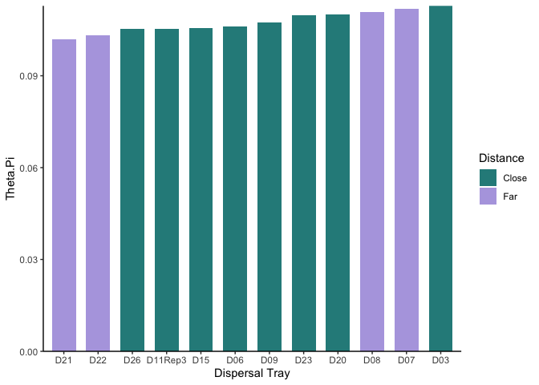
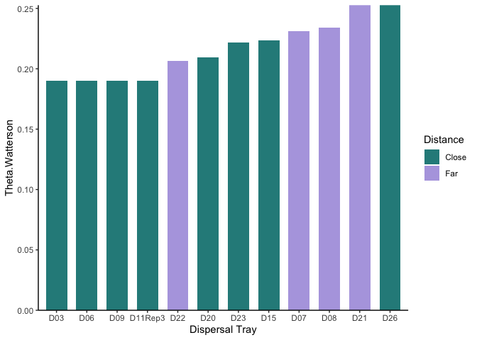
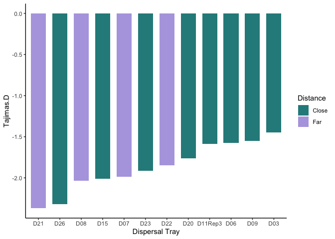

# Analyzing the genetic data from the Close and Far dispersal trays

To Do:

-   Incorporate the Source populations

-   Try computing the diversity metrics and FST using sliding windows so that I can get estimates of variation across the genome 

-   Compare ecotype frequencies (did some ecotypes disperse better?)

-   Figure out a way to test for bias in allele frequencies

-   Only compare FST within blocks 

## Libraries

``` r
library(tidyverse)
```

```
## ── Attaching core tidyverse packages ──────────────────────── tidyverse 2.0.0 ──
## ✔ dplyr     1.1.4     ✔ readr     2.1.5
## ✔ forcats   1.0.0     ✔ stringr   1.5.1
## ✔ ggplot2   3.5.1     ✔ tibble    3.2.1
## ✔ lubridate 1.9.3     ✔ tidyr     1.3.1
## ✔ purrr     1.0.2     
## ── Conflicts ────────────────────────────────────────── tidyverse_conflicts() ──
## ✖ dplyr::filter() masks stats::filter()
## ✖ dplyr::lag()    masks stats::lag()
## ℹ Use the conflicted package (<http://conflicted.r-lib.org/>) to force all conflicts to become errors
```

``` r
sem <- function(x, na.rm=FALSE) {           #for calculating standard error
  sd(x,na.rm=na.rm)/sqrt(length(na.omit(x)))
} 
```

## Load Sample Info

``` r
sample_info <- read_csv("../../Analyzing Genetic Data/DispersalTraps/hapFire_Results/SNPs_to_analyze/DispSamples.csv")
```

```
## Rows: 12 Columns: 3
## ── Column specification ────────────────────────────────────────────────────────
## Delimiter: ","
## chr (2): PopID, Treatment
## dbl (1): Pool.Size
## 
## ℹ Use `spec()` to retrieve the full column specification for this data.
## ℹ Specify the column types or set `show_col_types = FALSE` to quiet this message.
```

``` r
head(sample_info)
```

```
## # A tibble: 6 × 3
##   PopID   Pool.Size Treatment
##   <chr>       <dbl> <chr>    
## 1 D03            50 Close    
## 2 D06            50 Close    
## 3 D09            50 Close    
## 4 D11Rep3        50 Close    
## 5 D15            23 Close    
## 6 D20            31 Close
```

## Load Genome-Wide Diversity

Nucleotide diversity (theta_pi) - This quantifies the average number of differences (mismatches) between any pair of DNA sequences in a sample The higher this statistic, the more differences you will expect to see between any pair of randomly sampled DNA sequences.

Watterson’s estimator (theta_w) - This quantifies the number of segregating sites within a sample, scaled by a constant. The higher this statistic, the more sites are found to be segregating (i.e., polymorphic).

Tajima’s D (tajima_d) - This quantifies the difference between Watterson’s estimator and nucleotide diversity, and scales the result by a constant. This statistic is useful because it focuses not on the magnitude but on the architecture of diversity in a sample, compared to a neutrally evolving population of constant size. Negative values imply an excess of rare alleles, and positive values imply a deficit of rare alleles, relative to a population at equilibrium.

``` r
genome_wide_diversity <- read_csv("../../Analyzing Genetic Data/DispersalTraps/hapFire_Results/SNPs_to_analyze/diversity_genome.csv") 
```

```
## Rows: 1 Columns: 81
## ── Column specification ────────────────────────────────────────────────────────
## Delimiter: ","
## dbl (80): start, end, total.masked, total.missing, total.empty, total.numeri...
## lgl  (1): chrom
## 
## ℹ Use `spec()` to retrieve the full column specification for this data.
## ℹ Specify the column types or set `show_col_types = FALSE` to quiet this message.
```

``` r
genome_wide_diversity_diagnostics <- genome_wide_diversity %>% 
  select(total.masked:total.passed)
genome_wide_diversity_diagnostics #3181529 SNPs
```

```
## # A tibble: 1 × 6
##   total.masked total.missing total.empty total.numeric total.invariant
##          <dbl>         <dbl>       <dbl>         <dbl>           <dbl>
## 1            0             0           0             0           53951
## # ℹ 1 more variable: total.passed <dbl>
```

``` r
genome_wide_diversity_short <- genome_wide_diversity %>% 
  select(D03.theta_pi:D26.tajimas_d) %>% 
  select(-contains("missing"), -contains("passed"), -contains("numeric"))

genome_wide_thetapi <- genome_wide_diversity_short %>% 
  select(contains("theta_pi")) %>% 
  pivot_longer(
    cols = ends_with("theta_pi"),
    names_to = "PopID",
    values_to = "Theta.Pi"
  ) %>% 
  mutate(PopID=str_remove(PopID, ".theta_pi"))

genome_wide_thetawatterson <- genome_wide_diversity_short %>% 
  select(contains("theta_watterson")) %>% 
  pivot_longer(
    cols = ends_with("theta_watterson"),
    names_to = "PopID",
    values_to = "Theta.Watterson"
  ) %>% 
  mutate(PopID=str_remove(PopID, ".theta_watterson"))

genome_wide_tajimasd <- genome_wide_diversity_short %>% 
  select(contains("tajimas_d")) %>% 
  pivot_longer(
    cols = ends_with("tajimas_d"),
    names_to = "PopID",
    values_to = "Tajimas.D"
  ) %>% 
  mutate(PopID=str_remove(PopID, ".tajimas_d"))

genome_wide_diversity_long <- sample_info %>% 
  left_join(genome_wide_thetapi) %>% 
  left_join(genome_wide_thetawatterson) %>% 
  left_join(genome_wide_tajimasd)
```

```
## Joining with `by = join_by(PopID)`
## Joining with `by = join_by(PopID)`
## Joining with `by = join_by(PopID)`
```

### Plots with all dispersal trays 

``` r
genome_wide_diversity_long %>% 
  ggplot(aes(x=fct_reorder(PopID, Theta.Pi), y=Theta.Pi, group = Treatment, fill=Treatment)) +
  geom_col(width=0.7, position=position_dodge(0.8)) + 
  theme_classic() + labs(x="Dispersal Tray", fill="Distance") +
  scale_y_continuous(expand = c(0, 0)) +
  scale_fill_manual(values=c("#298B8A", "#B4A7E1")) 
```

<!-- -->

``` r
genome_wide_diversity_long %>% 
  ggplot(aes(x=fct_reorder(PopID, Theta.Watterson), y=Theta.Watterson, group = Treatment, fill=Treatment)) +
  geom_col(width=0.7, position=position_dodge(0.8)) + 
  theme_classic() + labs(x="Dispersal Tray", fill="Distance") +
  scale_y_continuous(expand = c(0, 0)) +
  scale_fill_manual(values=c("#298B8A", "#B4A7E1")) 
```

<!-- -->

``` r
genome_wide_diversity_long %>% 
  ggplot(aes(x=fct_reorder(PopID, Tajimas.D), y=Tajimas.D, group = Treatment, fill=Treatment)) +
  geom_col(width=0.7, position=position_dodge(0.8)) + 
  theme_classic() + labs(x="Dispersal Tray", fill="Distance") +
  scale_fill_manual(values=c("#298B8A", "#B4A7E1")) 
```

<!-- -->

### Summarize by Distance

``` r
genome_wide_diversity_summary <- genome_wide_diversity_long %>% 
  group_by(Treatment) %>% 
  summarise(meanTheta.Pi=mean(Theta.Pi), 
            meanTheta.Watterson=mean(Theta.Watterson),
            meanTajimas.D=mean(Tajimas.D))
genome_wide_diversity_summary
```

```
## # A tibble: 2 × 4
##   Treatment meanTheta.Pi meanTheta.Watterson meanTajimas.D
##   <chr>            <dbl>               <dbl>         <dbl>
## 1 Close            0.108               0.208         -1.77
## 2 Far              0.107               0.231         -2.06
```

``` r
genome_wide_diversity_summary %>% 
  ggplot(aes(x=Treatment, y=meanTheta.Pi, fill=Treatment)) +
  geom_col(width=0.7, position=position_dodge(0.8)) + 
  theme_classic() + #labs(x="Dispersal Tray", fill="Distance") +
  scale_y_continuous(expand = c(0, 0)) +
  scale_fill_manual(values=c("#298B8A", "#B4A7E1")) 
```

<!-- -->

``` r
genome_wide_diversity_summary %>% 
  ggplot(aes(x=Treatment, y=meanTheta.Watterson, fill=Treatment)) +
  geom_col(width=0.7, position=position_dodge(0.8)) + 
  theme_classic() + #labs(x="Dispersal Tray", fill="Distance") +
  scale_y_continuous(expand = c(0, 0)) +
  scale_fill_manual(values=c("#298B8A", "#B4A7E1")) 
```

<!-- -->

``` r
genome_wide_diversity_summary %>% 
  ggplot(aes(x=Treatment, y=meanTajimas.D, fill=Treatment)) +
  geom_col(width=0.7, position=position_dodge(0.8)) + 
  theme_classic() + #labs(x="Dispersal Tray", fill="Distance") +
  scale_fill_manual(values=c("#298B8A", "#B4A7E1")) 
```

<!-- -->

## Genome-Wide FST

``` r
genome_wide_FST <- read_csv("../../Analyzing Genetic Data/DispersalTraps/hapFire_Results/SNPs_to_analyze/fst_genome.csv") 
```

```
## Rows: 1 Columns: 273
## ── Column specification ────────────────────────────────────────────────────────
## Delimiter: ","
## dbl (272): start, end, total.masked, total.missing, total.empty, total.numer...
## lgl   (1): chrom
## 
## ℹ Use `spec()` to retrieve the full column specification for this data.
## ℹ Specify the column types or set `show_col_types = FALSE` to quiet this message.
```

``` r
genome_wide_FST
```

```
## # A tibble: 1 × 273
##   chrom start   end total.masked total.missing total.empty total.numeric
##   <lgl> <dbl> <dbl>        <dbl>         <dbl>       <dbl>         <dbl>
## 1 NA        0     0            0             0           0             0
## # ℹ 266 more variables: total.invariant <dbl>, total.passed <dbl>,
## #   `D03:D06.missing` <dbl>, `D03:D06.numeric` <dbl>, `D03:D06.passed` <dbl>,
## #   `D03:D06.fst` <dbl>, `D03:D07.missing` <dbl>, `D03:D07.numeric` <dbl>,
## #   `D03:D07.passed` <dbl>, `D03:D07.fst` <dbl>, `D03:D08.missing` <dbl>,
## #   `D03:D08.numeric` <dbl>, `D03:D08.passed` <dbl>, `D03:D08.fst` <dbl>,
## #   `D03:D09.missing` <dbl>, `D03:D09.numeric` <dbl>, `D03:D09.passed` <dbl>,
## #   `D03:D09.fst` <dbl>, `D03:D11Rep3.missing` <dbl>, …
```

``` r
genome_wide_FST_list <- read_csv("../../Analyzing Genetic Data/DispersalTraps/hapFire_Results/SNPs_to_analyze/fst-list_genome.csv")
```

```
## Rows: 66 Columns: 12
## ── Column specification ────────────────────────────────────────────────────────
## Delimiter: ","
## chr  (2): first, second
## dbl (10): total.masked, total.missing, total.empty, total.numeric, total.inv...
## 
## ℹ Use `spec()` to retrieve the full column specification for this data.
## ℹ Specify the column types or set `show_col_types = FALSE` to quiet this message.
```

``` r
head(genome_wide_FST_list)
```

```
## # A tibble: 6 × 12
##   first second  total.masked total.missing total.empty total.numeric
##   <chr> <chr>          <dbl>         <dbl>       <dbl>         <dbl>
## 1 D03   D06                0             0           0             0
## 2 D03   D07                0             0           0             0
## 3 D03   D08                0             0           0             0
## 4 D03   D09                0             0           0             0
## 5 D03   D11Rep3            0             0           0             0
## 6 D03   D15                0             0           0             0
## # ℹ 6 more variables: total.invariant <dbl>, total.passed <dbl>,
## #   sample.missing <dbl>, sample.numeric <dbl>, sample.passed <dbl>, fst <dbl>
```

``` r
genome_wide_FST_matrix <- read_csv("../../Analyzing Genetic Data/DispersalTraps/hapFire_Results/SNPs_to_analyze/fst-matrix_genome.csv")
```

```
## Rows: 12 Columns: 13
## ── Column specification ────────────────────────────────────────────────────────
## Delimiter: ","
## chr  (1): fst
## dbl (12): D03, D06, D07, D08, D09, D11Rep3, D15, D20, D21, D22, D23, D26
## 
## ℹ Use `spec()` to retrieve the full column specification for this data.
## ℹ Specify the column types or set `show_col_types = FALSE` to quiet this message.
```

``` r
genome_wide_FST_matrix
```

```
## # A tibble: 12 × 13
##    fst       D03     D06     D07     D08     D09 D11Rep3     D15     D20     D21
##    <chr>   <dbl>   <dbl>   <dbl>   <dbl>   <dbl>   <dbl>   <dbl>   <dbl>   <dbl>
##  1 D03   0       0.0179  0.00444 0.00683 0.0145  0.0151  0.0118  0.00881 0.0186 
##  2 D06   0.0179  0       0.00936 0.0163  0.0228  0.0212  0.0223  0.0124  0.0249 
##  3 D07   0.00444 0.00936 0       0.00123 0.00746 0.00529 0.00157 0.00107 0.00665
##  4 D08   0.00683 0.0163  0.00123 0       0.00444 0.00354 0.00589 0.00458 0.0145 
##  5 D09   0.0145  0.0228  0.00746 0.00444 0       0.00695 0.0135  0.0101  0.0199 
##  6 D11R… 0.0151  0.0212  0.00529 0.00354 0.00695 0       0.00904 0.00739 0.0173 
##  7 D15   0.0118  0.0223  0.00157 0.00589 0.0135  0.00904 0       0.0108  0.0127 
##  8 D20   0.00881 0.0124  0.00107 0.00458 0.0101  0.00739 0.0108  0       0.0118 
##  9 D21   0.0186  0.0249  0.00665 0.0145  0.0199  0.0173  0.0127  0.0118  0      
## 10 D22   0.0230  0.0294  0.0104  0.0176  0.0230  0.0203  0.0207  0.0126  0.0189 
## 11 D23   0.0122  0.0194  0.00280 0.00990 0.0144  0.0131  0.0135  0.00694 0.0130 
## 12 D26   0.0174  0.0253  0.00798 0.00690 0.0136  0.0157  0.0166  0.0116  0.0191 
## # ℹ 3 more variables: D22 <dbl>, D23 <dbl>, D26 <dbl>
```

``` r
genome_wide_FST_comp_types <- genome_wide_FST_list %>% 
  select(Pop1=first, Pop2=second, fst) %>% 
  mutate(Pop1_Dist=if_else(Pop1=="D07" | Pop1=="D08" | Pop1=="D21" | Pop1=="D22", "Far", "Close"),
         Pop2_Dist=if_else(Pop2=="D07" | Pop2=="D08" | Pop2=="D21" | Pop2=="D22", "Far", "Close"),
         Comparison_Type=if_else(Pop1_Dist=="Close" & Pop2_Dist=="Close", "Close-Close",
                                 if_else(Pop1_Dist=="Far" & Pop2_Dist=="Far", "Far-Far", "Close-Far")))

genome_wide_FST_comp_types %>% 
  ggplot(aes(x=Comparison_Type, y=fst)) +
  geom_boxplot()
```

<!-- -->

``` r
genome_wide_FST_comp_types_summary <- genome_wide_FST_comp_types %>% 
  group_by(Comparison_Type) %>% 
  summarise(meanFst=mean(fst), semFst=sem(fst))
genome_wide_FST_comp_types_summary
```

```
## # A tibble: 3 × 3
##   Comparison_Type meanFst   semFst
##   <chr>             <dbl>    <dbl>
## 1 Close-Close      0.0143 0.000912
## 2 Close-Far        0.0122 0.00135 
## 3 Far-Far          0.0116 0.00278
```

``` r
genome_wide_FST_comp_types_summary %>% 
  ggplot(aes(x=fct_reorder(Comparison_Type, meanFst), y=meanFst)) +
  geom_col(width = 0.7, position = position_dodge(0.8)) + 
  geom_errorbar(aes(ymin=meanFst-semFst, ymax=meanFst+semFst), width=.2, position = position_dodge(0.8)) + 
  labs(x="Comparison Type", y="Avg Genome-Wide FST") +
  scale_y_continuous(expand = c(0, 0)) +
  theme_classic() 
```

<!-- -->
